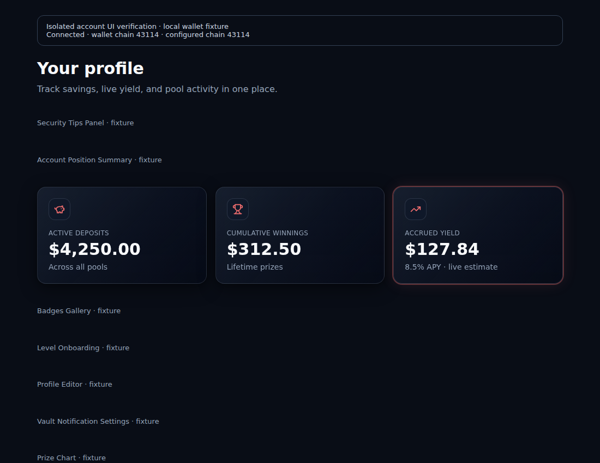
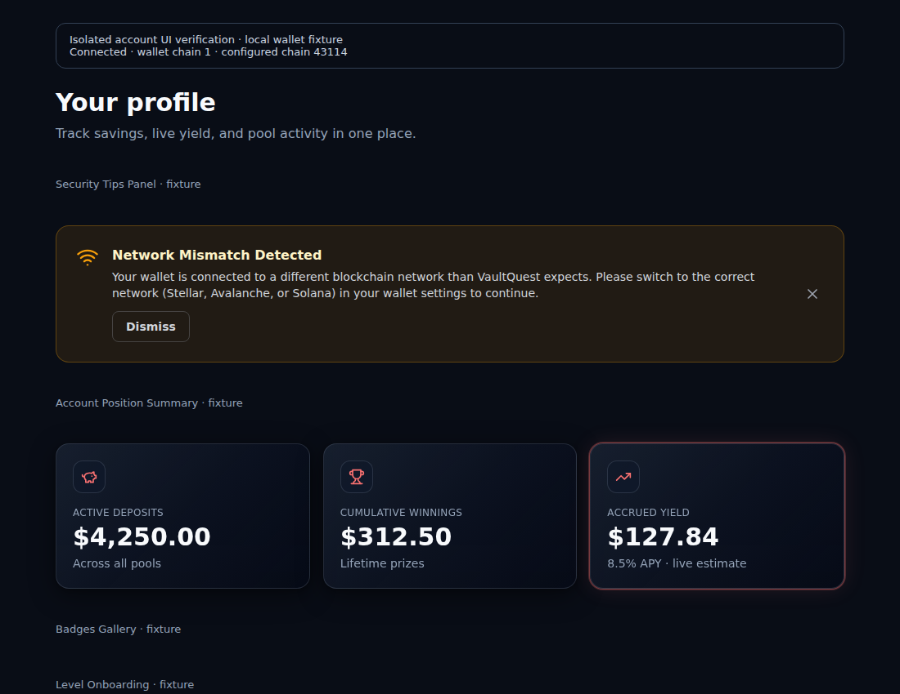

# Account wallet and network state

The account page implements [issue #114](https://github.com/Vaultquest/vaultquest/issues/114): production connection and network state come from wallet providers; URL overrides remain explicit development/E2E fixtures.

## Connected wallet chain

Read `isConnected` and `chainId` from the same `useAccount()` result. An unsupported wallet network must still be visible to the mismatch check.

`useChainId()` describes Wagmi's current configured chain. If the wallet moves to a chain outside the configuration, Wagmi retains the last configured chain. Comparing that value with the supported-chain list therefore misses exactly the unsupported networks that need guidance.

The account page now passes `useAccount().chainId` into the existing resolver. The configured Avalanche/Fuji networks, connection handling, fixture parser, and runtime E2E opt-in are unchanged.

Primary dependency evidence:

- [Wagmi useChainId contract](https://wagmi.sh/react/api/hooks/useChainId)
- [Locked core 2.22.1 configured-chain subscription](https://github.com/wevm/wagmi/blob/@wagmi/core@2.22.1/packages/core/src/createConfig.ts)
- [Locked core 2.22.1 account-chain getter](https://github.com/wevm/wagmi/blob/@wagmi/core@2.22.1/packages/core/src/actions/getAccount.ts)

## Native reproduction before the correction

The unchanged helper from PR head `4f53166c072175a2a1b16237b08ca516579abe50` was exercised with the retained real Wagmi configuration/actions and its built-in mock connector. The connector provided local wallet events; the probe made **zero network requests**.

| Wallet state | Account chain | Configured chain | Original page input: mismatch | Account-chain control: mismatch |
|---|---:|---:|---|---|
| Connected to Avalanche | 43114 | 43114 | false | false |
| Switched to Ethereum | 1 | 43114 | false | true |
| Switched to Fuji | 43113 | 43113 | false | false |
| Switched to Polygon | 137 | 43113 | false | true |
| Disconnected | absent | 43113 | false | false |

The original component test supplied an unsupported value directly from its `useChainId` mock, which did not represent this Wagmi behavior.

## Maintained regression checks

`lib/account-wallet-state.test.js` retains the connected/disconnected, supported-network, hostile production query and explicit E2E fixture controls.

`app/app/account/page.test.jsx` now distinguishes the account chain from the configured chain for Ethereum and Polygon. Its real-hook integration case uses a local connector with `WagmiProvider`, `connect`, and `disconnect`; it exercises supported, unsupported, restored-supported, second-unsupported, and disconnected states without a chain transport.

Configured test selection:

```bash
pnpm exec vitest run lib/account-wallet-state.test.js app/app/account/page.test.jsx
```

The focused selection passes **21 tests** (15 helper controls and 6 component cases), including the actual Wagmi provider transition case. Scoped ESLint 8.57.1 with the project's Next 14.2.33 configuration passes with zero errors or warnings.

The first local attempt passed 20 cases and stopped at an absent `wagmi/actions` export file in the retained donor. A local validation alias restored its four reexports to the real core `connect`, `disconnect`, `getAccount`, and `getChainId` implementations; the maintained test imports and repository dependencies were unchanged. The complete selection then passed. The lint runtime likewise needed an owned link to the retained Next Babel preset before the configured check could run.

## Browser recording of the corrected flow

A 5.56-second [network transition recording](images/account-wallet-network-transition.webm) exercises the corrected account page in native Chromium 154.0.8037.92 with Playwright 1.62.1. It shows disconnected, supported Avalanche, unsupported Ethereum, restored Fuji, unsupported Polygon, and disconnected states in sequence.

The rendered page, resolver, reconnect guidance, Wagmi provider, hooks, and actions are real. The wallet connector is local; unrelated widgets and the RainbowKit modal use isolated fixtures. The run reported zero page errors, console errors, or external requests. Its only requests were three local static GETs for the page, stylesheet, and bundle.

These captures are supported and unsupported states of the corrected code, rather than an original-source before/after comparison:





The recording uses an isolated automatic-JSX bundle and the existing project stylesheet. It verifies the account-state composition and visible guidance; it is not a full Next application or deployed-wallet run.

## Validation environment and limits

The retained runtime uses Node 24.19.0, Vitest 2.1.9, Vite 5.4.21, jsdom 25.0.1, and React/ReactDOM 18.3.1. It uses Wagmi 2.14.6, core 2.16.3, and Viem 2.57.2; the repository lock specifies Wagmi 2.19.5, core 2.22.1, and its Wagmi-associated Viem 2.51.3. The relevant getter and configured-chain exclusion were also checked in the pinned core 2.22.1 source.

The retained Testing Library React is 16.3.2 (manifest: ^14.3.1), and Lucide is 0.378.0 (manifest: ^0.460.0). The local validation configuration deduplicates React, uses the existing widget test factories, and supplies a small RainbowKit modal fixture. These are local validation settings; no dependency, lockfile, wallet-provider configuration, or production test-fixture mechanism changes are included.

No wallet signing, chain RPC, transaction, authenticated backend, or deployed service is exercised. Full Next application build, full workspace unit/route/Playwright suites and the sponsor Node 20 matrix are not claimed.
