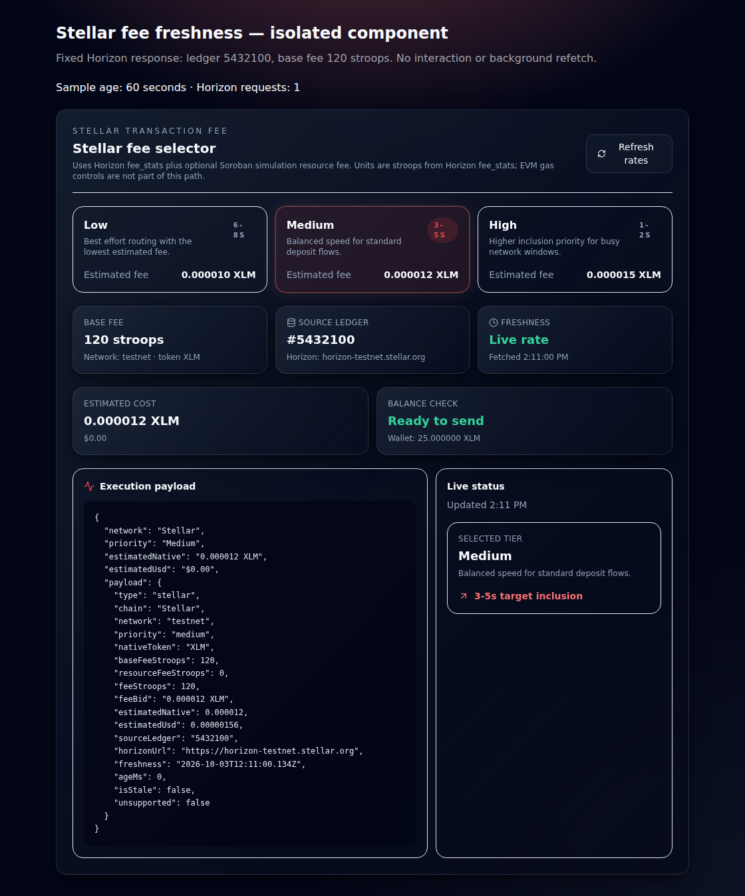
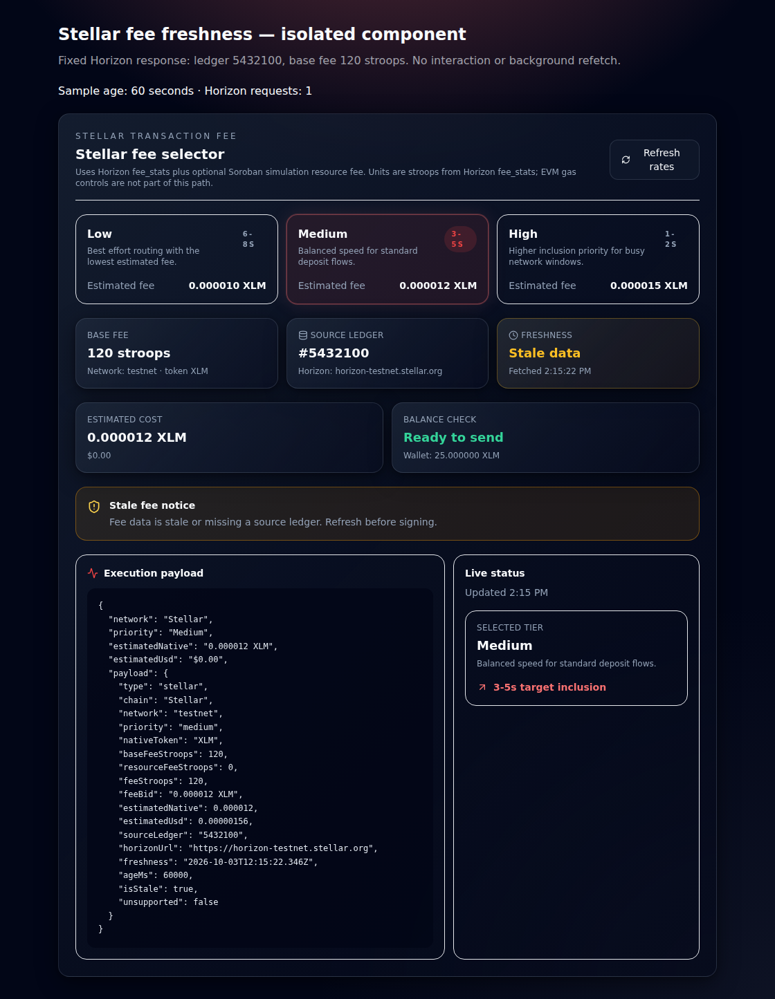
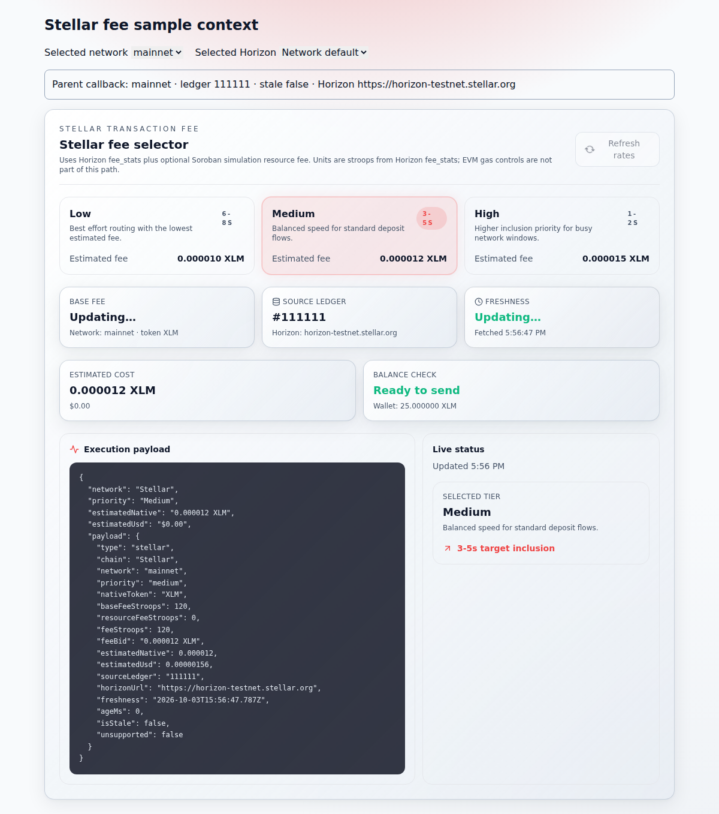
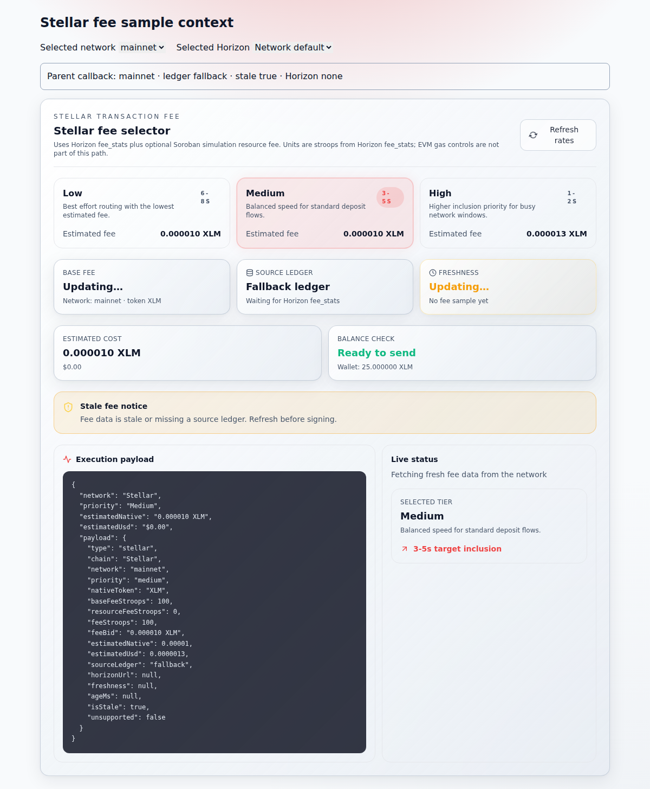

# Chain fee adapters

VaultQuest keeps **Stellar** and **Avalanche** fee / RPC controls on separate
adapters so deposit and withdraw flows cannot mix stroops with wei or Horizon
with C-Chain RPCs.

## Stellar (default for vault UI)

- Adapter: `lib/chain-fee-adapters.js` (`fetchStellarFeeStats`, `buildStellarFeeEstimate`)
- UI: `GasPrioritySelector` with `network="stellar"` (default)
- Fee model: Horizon `/fee_stats` base fee (stroops) + optional Soroban
  simulation resource fee
- Estimates always expose **source ledger** (`last_ledger`) and **freshness**
  (fetch timestamp / stale warning)
- A loaded Stellar sample becomes stale after **60 seconds**, even while the
  selector is idle. The warning and the parent callback's `isStale` and
  `payload.isStale` update together; expiry does not issue another network request.
  Refreshing rates starts a new deadline. The old deadline is cleared on refresh,
  unmount, unsupported state, or a switch to the Avalanche model.
- A sample belongs to the network and Horizon context that requested it. Changing
  the network, custom Horizon source, or supported Stellar context immediately
  removes the previous ledger and Horizon attribution. Until the matching request
  succeeds, the selector exposes the fallback ledger, a null Horizon URL, and
  `isStale: true` in both parent fields. This applies during the first render of
  the changed context, before effects run. A refresh within the same context can
  retain its valid sample while loading; a cancelled earlier request cannot
  replace the current sample. A failed new source cannot inherit another source's
  Horizon URL.
- Explorers: Stellar Expert only — never EVM explorers on this path
- Custom RPC: Horizon overrides save independently via the Stellar tab in
  `CustomRpcModal`

## Avalanche (independently routed product)

- Avalanche C-Chain / Fuji RPC fields and EVM gas math remain available when
  `network="avalanche"` is passed explicitly, or via the Avalanche tab in
  custom RPC settings.
- Stellar deposit/withdraw flows must not depend on Avalanche RPC, chain ID,
  or wei controls.

## Acceptance checklist (#123)

- [x] Stellar deposit/withdraw flows contain no EVM explorer, wei, chain ID, or Avalanche RPC dependency
- [x] Fee estimates state source ledger and freshness
- [x] Tests cover Stellar testnet/mainnet, stale fee data, custom Horizon, unsupported network

## Idle fee expiry verification

The existing fee suite includes exact 59,999 / 60,000 ms checks for testnet and
mainnet, refreshing before and after expiry, switching to unsupported/Avalanche,
and unmount cleanup. These run the real selector and fee adapter against a
controlled Horizon response.

The screenshots below show the actual component with the project stylesheet in
Chromium 154 after at least 60 seconds without interaction or a second fetch.
The response is fixed at ledger `5432100` and base fee `120` stroops. This is an
isolated component fixture, not a full application or live Horizon test.

| Before the expiry fix | After the expiry fix |
| --- | --- |
|  |  |

## Network and Horizon context verification

The context continuation preserves the expiry behavior above and adds nine cases
to the existing selector suite. They cover both network-switch directions,
custom Horizon replacement and failure, returning to an earlier context,
unsupported-state reactivation, a refresh within the same context, and delayed
success or failure from a cancelled earlier request. The network-switch cases
also inspect the first committed render before passive effects and every parent
callback while the replacement request is held.

```bash
npm test -- \
  lib/chain-fee-adapters.test.js \
  components/app/GasPrioritySelector.test.jsx \
  components/app/CustomRpcModal.test.jsx \
  lib/customRpc.test.js \
  --maxWorkers=1 --minWorkers=1
```

The four-file selection passes **54/54** checks. Substituting the exact preceding
component from `221177edc1e6ae890649c3a0a4c883cfc86945c0`, with the same final tests,
produces **6 failures / 48 passes**: all six failures concern context attribution;
the existing 45 checks and the three new refresh/cancellation controls pass.
The changed JSX files pass the repository's Next 14 / ESLint 8 configuration.
The product-term guard passes on the materialized sparse checkout, and
`git diff --check` passes. No dependency or lockfile files changed.

The browser observation uses the actual selector, chain adapter, custom RPC
resolver, wagmi chain metadata, and project stylesheet in **Chromium
153.0.8010.0**. Parent prop controls are an isolated fixture; Horizon responses
are intercepted and held. Each version makes seven fee requests and records
eleven snapshots, with no page errors or unexpected external requests.

| Observed transition | Preceding component | Corrected component |
| --- | --- | --- |
| Testnet to mainnet, new request pending | Mainnet callback retains testnet ledger `111111` and testnet Horizon; both stale flags are false | Fallback ledger, null Horizon, and both stale flags true until mainnet ledger `222222` arrives |
| Custom Horizon changes, new request pending | Previous source's ledger and Horizon remain attributed as fresh | Previous attribution is cleared immediately |
| New custom Horizon returns HTTP 503 | Fallback still carries the preceding Horizon URL | Fallback has no Horizon attribution |
| Same-context refresh and cancelled earlier response | Valid sample survives the refresh wait; late cancelled response is ignored | Both controls remain unchanged |

| Before the context fix, mainnet request pending | After the context fix, same request pending |
| --- | --- |
|  |  |

Validation used retained Node 24.19.0, Vitest 2.1.9, React / React DOM 18.3.1,
jsdom 25.0.1, wagmi 2.14.6, Vite 5.4.21, and esbuild 0.21.5. Testing Library React
16.3.2 and lucide-react 0.378.0 (tests) / 0.363.0 (browser) differ from the declared
Testing Library ^14.3.1 / lucide-react ^0.460.0 ranges. These focused tests and
the isolated browser fixture do not establish a complete lockfile installation,
full application build or route E2E, the Node 20 matrix, or live Horizon behavior.

## RPC reply validation continuation — October 4, 2026

The independently routed Avalanche endpoint probe now requires a JSON-RPC 2.0
reply for numeric request ID `1`, rejects any reply that also includes an
`error` member, and validates the complete canonical hexadecimal chain
quantity. Chain comparisons use `BigInt`, so a different chain cannot match
because `parseInt` rounded its ID. A provider error is shown only when its
message is a string. Valid zero and uppercase hexadecimal digits remain
accepted; URL/storage policy, Horizon behavior and fee calculations are unchanged.

The response rules follow the [JSON-RPC response specification](https://www.jsonrpc.org/specification#response_object)
and [Ethereum quantity encoding](https://ethereum.org/developers/docs/apis/json-rpc/#quantities).
This validates a provider's reply; it does not prove that an untrusted provider
reports its network truthfully.

### Executed source and results

Product source: [`d127ab5e5ba1c6ad40ff79e185c6e62e240e7425`](https://github.com/woahwhattheheck/vaultquest/commit/d127ab5e5ba1c6ad40ff79e185c6e62e240e7425),
a successor of `abc6d8a4aa13f00ca8333271faa824a3df86af36`.
The production blob is `97010788625d770be502bd40713677d0255fbe62`;
the maintained test blob is `ec5eddbaa578d6526952748110c850d8b750290b`.

[Successful focused run 37203082612](https://github.com/woahwhattheheck/vaultquest/actions/runs/37203082612/job/111438574349)
uses isolated controller
[`378658d715acc0c482f060eac7fdbf0fd2180b8c`](https://github.com/woahwhattheheck/vaultquest/blob/378658d715acc0c482f060eac7fdbf0fd2180b8c/.github/workflows/vq214-rpc-reply-relay17.yml).
The controller is kept off the product branch. It checks exact source blobs,
installs the accepted dependency files with the canonical package manager,
replaces only the production module with the original for the baseline, then
restores and executes the exact candidate.

```bash
pnpm install --frozen-lockfile --reporter=append-only
pnpm exec vitest run lib/customRpc.test.js --maxWorkers=1 --minWorkers=1 \
  --reporter=default --reporter=json --outputFile.json=evidence/after.json
```

| Executed production | Maintained file result | Vitest duration |
| --- | --- | --- |
| Original blob `fe2f06a68aad82d3b21efb64d2491e7feae88bff` | 7 failed / 20 passed | 695 ms; 17 ms tests |
| Candidate blob `97010788625d770be502bd40713677d0255fbe62` | 27 passed / 0 failed | 648 ms; 11 ms tests |

All seven failures were the added invalid-reply cases: a hexadecimal garbage
suffix, a leading zero, error plus result, missing protocol version, mismatched
request ID, an empty quantity without an expected chain, and
`0x20000000000001` incorrectly matching numeric `9007199254740992`.
The eighteen original cases and the zero/uppercase controls passed on both
versions. The final run has no pending, todo or skipped cases. These durations
describe the focused check, not provider or application performance.

The normal frozen installation passed for all three workspace projects in
15.3 seconds. Runtime: Node 22.23.3, pnpm 10.28.2, Vitest 3.2.7, Vite 6.4.3,
jsdom 25.0.1 and wagmi 2.19.5. Existing dependency overrides and build permissions
were retained; the install reported ignored package build scripts and no new
permissions were granted. Dependency checksums and all tracked inputs remained
unchanged after execution; `git diff --exit-code` and `git diff --check` passed.

The [uploaded evidence artifact](https://github.com/woahwhattheheck/vaultquest/actions/runs/37203082612/artifacts/11303736484)
contains raw baseline/candidate JSON and logs, the installation log, runtime and
source records. Its reported size is 28,495 bytes and the runner-reported ZIP
SHA-256 is `4147c31d42fb68dc2d74b02185922295e000a70808b3f33936870a510eab9b4b`
(14-day retention). The source-bound receipt below remains in Git after artifact
retention expires.

```json
{
  "observedAt": "2026-10-04T12:43:50.466054+00:00",
  "runId": "37203082612",
  "controller": "378658d715acc0c482f060eac7fdbf0fd2180b8c",
  "productSource": "d127ab5e5ba1c6ad40ff79e185c6e62e240e7425",
  "baselineSource": "abc6d8a4aa13f00ca8333271faa824a3df86af36",
  "productionBlob": "97010788625d770be502bd40713677d0255fbe62",
  "maintainedTestBlob": "ec5eddbaa578d6526952748110c850d8b750290b",
  "before": {
    "numTotalTests": 27,
    "numPassedTests": 20,
    "numFailedTests": 7,
    "numPendingTests": 0,
    "numTodoTests": 0
  },
  "after": {
    "numTotalTests": 27,
    "numPassedTests": 27,
    "numFailedTests": 0,
    "numPendingTests": 0,
    "numTodoTests": 0
  },
  "runtime": {
    "node": "v22.23.3",
    "vitest": "3.2.7",
    "vite": "6.4.3",
    "jsdom": "25.0.1",
    "wagmi": "2.19.5"
  },
  "scope": "Full existing customRpc test file with real installed dependencies and controlled HTTP replies; no live provider or transaction submission.",
  "trackedInputsUnchanged": true
}
```

The earlier [controller run 37202869204](https://github.com/woahwhattheheck/vaultquest/actions/runs/37202869204)
installed the workspace but stopped during collection because the prepared test
text contained an assembly error; it ran zero tests and is not product
validation. The corrected run above is the one baseline/candidate execution of
all 27 cases.

This check executes the actual RPC module with real installed dependencies and
controlled HTTP replies, plus the maintained URL/Horizon/storage cases. It does
not rerun the larger fee suite, full application build, browser journey, live
provider, wallet transaction or deployment. The historical fee evidence above
and in `FEE_OBSERVATION_VALIDITY.md` retains its original source and runtime
bounds.
