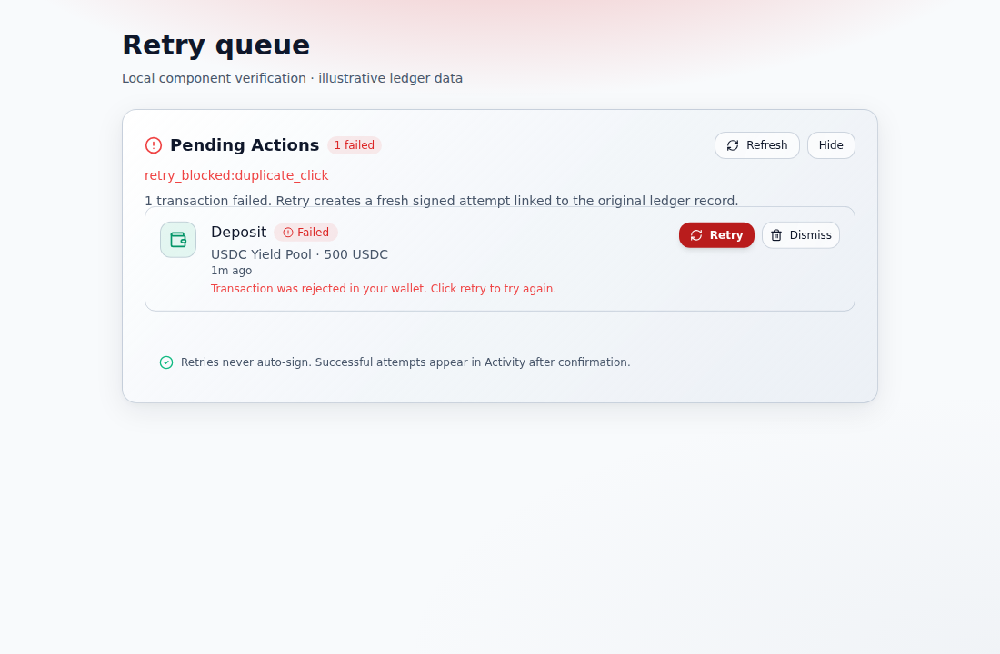
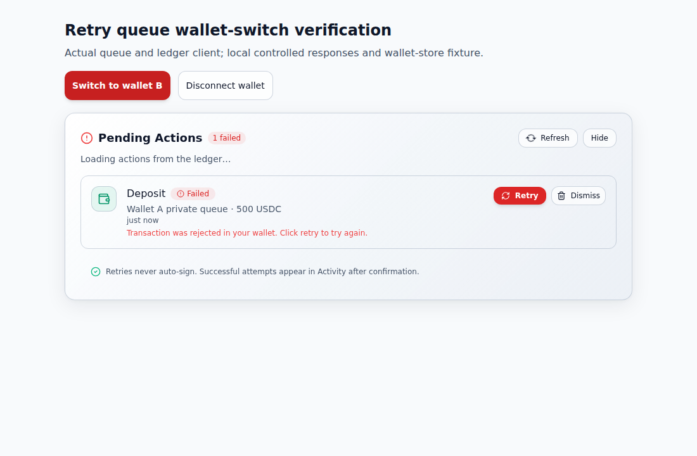
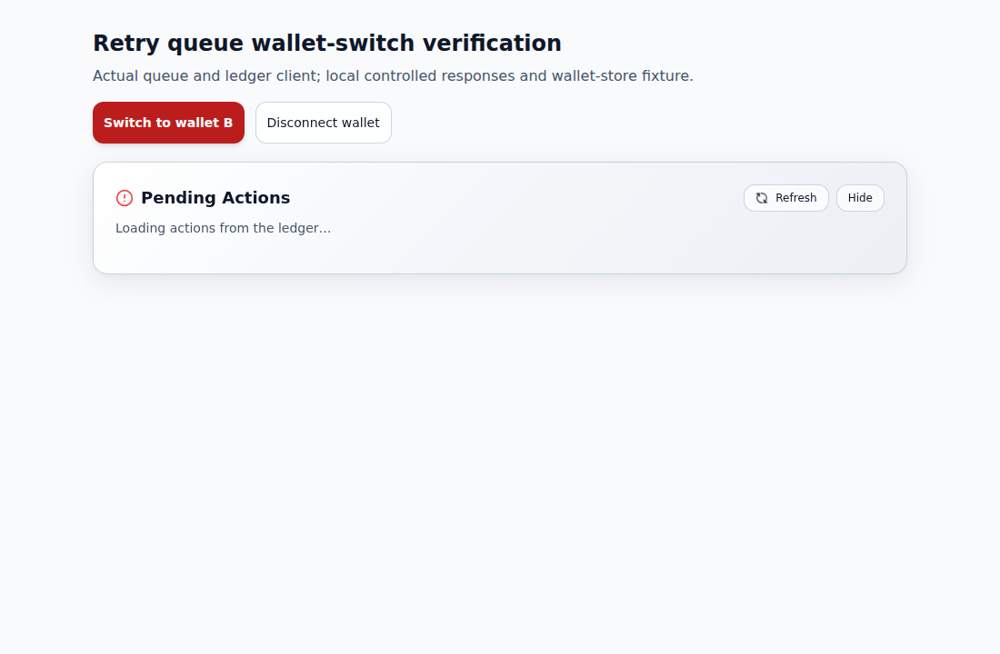

# Retry queue ↔ action ledger (#121)

The vault retry queue is backed by the authenticated action ledger. Fixture
rows and `setTimeout` fake retries are not used in production.

## Flow

1. **Load** — `GET /actions?wallet=<connected>` with wallet auth headers.
   Only `pending` and `failed` rows for the connected wallet are shown.
2. **Retry policy** — `lib/retry-queue-policy.js` decides whether an error
   code is retryable (`WALLET_REJECTED`, `RPC_TIMEOUT`, `INSUFFICIENT_FEES`,
   `NETWORK_ERROR`, `WALLET_TIMEOUT`, `TIMEOUT`). Confirmed / submitted /
   reverted / orphaned actions cannot be replayed.
3. **Fresh attempt** — Retry creates a **new** ledger intent (`POST /actions`)
   with a new idempotency key. The payload includes `parent_action_id` and
   `retry_of` linking back to the original. The UI may prompt for a wallet
   signature via an injected `requestSign` hook — **signing is never automatic**.
4. **Cancel** — Pending actions are cancelled with
   `POST /actions/:id/cancel` using `USER_CANCELLED`. Repeating cancel on an
   already-cancelled row is an idempotent success (ledger + client).
5. **Wallet switch** — Changing the connected public key clears local queue
   state and reloads for the new wallet so rows never leak across identities.

## Key modules

| Module | Role |
|--------|------|
| `lib/retry-queue-policy.js` | Error-code policy, row mapping, retry/cancel guards |
| `lib/retry-queue-client.js` | Authenticated ledger HTTP client |
| `components/app/VaultRetryQueue.jsx` | Queue UI |

## Tests

```bash
pnpm exec vitest run \
  lib/retry-queue-policy.test.js \
  lib/retry-queue-client.test.js \
  components/app/VaultRetryQueue.test.jsx
```

Covered scenarios: wallet rejection, RPC timeout, insufficient fees, duplicate
click, late confirmation, cancellation (including idempotent repeat), and
wallet switching.

## Component/client lock ownership

The continuation after `02d0f48acfa80cc9a5d24ae885f3bf03935cc0df` fixes the first Retry and Cancel clicks. Each handler acquired its synchronous component lock and then passed that same set to the client. The client's direct-call guard consequently rejected the current operation as `duplicate_click` before sending a mutation. The existing component tests replaced the client methods, so they did not expose this integration failure.

The handlers now retain their own duplicate-click guard without forwarding the already-held set. The production client and policy are unchanged: a direct caller that supplies an in-flight ID is still rejected. The component still acquires its lock before the authoritative read and releases it in `finally`. Both button flows can now reach the ledger request exactly once.

### Maintained regression coverage

Two cases in `components/app/VaultRetryQueue.test.jsx` use the real `createRetryQueueClient` and policy. Only the ledger transport is controlled. Each test holds the authoritative GET, clicks twice, checks the disabled button and single read, then releases the response. Retry must send one linked-intent POST and render its pending receipt. Cancel must send one cancellation POST and remove the row.

Against the original component, the three-file selection produced **2 failures and 24 passes**. With the two inappropriate context arguments removed, it produced **26 passes**. Existing late-confirmation, direct in-flight retry, terminal-status, wallet-mismatch and idempotent-cancel controls remain present and pass. The changed component/test also pass the repository's Next ESLint configuration, and the product-term and diff checks pass.

This was an isolated retained-runtime run. A bounded search found no `nanostores` package, so a local test configuration supplied an explicit `get`/`set`/`subscribe` wallet-store fixture at that provider boundary. The maintained tests still import the real wallet store; no fixture or alias was added to production or committed test configuration. The component, client and retry/cancel policy were real. The local configuration also deduplicated React across the retained package roots.

Runtime: Node 24.19.0, Vitest 2.1.9, Vite 5.4.21, jsdom 25.0.1, React/ReactDOM 18.3.1, ESLint 8.57.1 and `eslint-config-next` 14.2.33. The retained Testing Library React 16.3.2, Framer Motion 12.42.2 and Lucide 0.378.0 differ from the declared `^14.3.1`, `^11.15.0` and `^0.460.0` ranges respectively. The before/after runs used the same packages. Both runs emitted the same non-fatal jsdom `window.scrollTo` diagnostics and React `act` warnings from existing asynchronous component cases; these were not suppressed.

### Native browser and HTTP evidence

Chromium 154.0.8037.92 ran the original and fixed component bundles separately. Each used the real component, real client and policy, production `styles/globals.css`/Tailwind configuration, and the explicit wallet-store fixture described above. esbuild 0.21.5 built this isolated component; it was not a full Next application build. A local Node HTTP server supplied illustrative ledger records through actual browser fetch requests.

The authoritative GET was held while a second click was attempted. Releasing it produced these results, with no page exceptions in either phase:

| Flow | HTTP reads | HTTP mutations | Visible result |
| --- | --- | --- | --- |
| Original Retry | Queue list + one action GET | None | Original failed row; `retry_blocked:duplicate_click` |
| Fixed Retry | Queue list + one action GET | One `POST /actions` | New linked `act-retry` row, pending |
| Original Cancel | Queue list + one action GET | None | Original pending row; `cancel_blocked:duplicate_click` |
| Fixed Cancel | Queue list + one action GET | One `POST /actions/act-001/cancel` | Cancelled row removed |

The fixed retry sent a fresh idempotency key, retained the wallet header, and linked the original ID in both `parent_action_id` and `retry_of`. Its illustrative action payload was:

```json
{"vault_id":"v1","pool_name":"USDC Yield Pool","amount":"500","token":"USDC","parent_action_id":"act-001","retry_of":"act-001","retry_attempt":1}
```

The fixed cancel retained the wallet header and sent:

```json
{"error_code":"USER_CANCELLED","error_detail":"Action was cancelled by user"}
```

The stable original capture shows the first-click failure:



The fixed native run verified the pending retry row and removed cancel row as recorded above. Its after capture caught a transient Motion layout frame and is excluded from this PR; it is not presented as a settled layout comparison. The native interaction and HTTP assertions completed successfully before that capture.

### Verification limits

No dependency installation, manifest/lockfile change, upstream merge or signing-provider call was performed. The real `nanostores` integration, ordinary full workspace test configuration, sponsor Node 20 matrix, full Next application/production build, full route smoke/Playwright suite, authenticated backend/Postgres integration and deployed ledger were not exercised by this partial runtime. This continuation verifies the component/client composition defect and preserves the existing backend and wallet contracts.


## Wallet/client reload ownership

The next continuation starts from `f026e2884aaff1488f40eda2449ec131b5bf3884` and fixes a separate wallet-switch race. The prior first-click lock repair remains intact.

Previously, every completed list request could replace the visible rows, error, and loading state. Switching wallets started another request but did not immediately clear the previous rows or invalidate its pending response. A slower wallet A response could therefore replace wallet B's queue, and an A failure could clear B's rows and display the wrong error. Replacing the client while retaining the wallet had the same ownership gap.

Queue state and the local duplicate-click/dismissal sets now belong to a wallet/client context. A render with a different context immediately uses empty/loading state, before passive effects run. The outer content animation boundary is also unmounted, so neither a closing section nor row exit animation can retain another wallet's rows. Async state updates only apply to their originating context. Reload sequence numbers preserve the newest request within a context and invalidate pending requests on cleanup; stale success, error, and `finally` paths cannot overwrite the current load. Old retry/cancel completions likewise cannot change another context's UI. The client, policy, request payloads, signing behavior, and backend are unchanged; this is not transport cancellation of an already-started operation.

### Native before/after evidence

Chromium **153.0.8010.0** mounted the actual component and `createRetryQueueClient` against a local HTTP ledger. An explicit `get`/`set`/`subscribe` wallet-store fixture controlled wallet selection because no retained `nanostores` package was available. Each phase made eight real ledger GET requests, with no mutations, provider calls, external page requests, or page exceptions. The same retained stylesheet and dependency versions were used for both phases.

| Held-response scenario | Exact preceding component | Corrected component |
| --- | --- | --- |
| A success arrives after B has loaded | A's row replaces B's row under B's identity | B's row remains, with no A row or error |
| A HTTP 500 arrives after B has loaded | B's rows disappear; A's stale error is shown | B's row remains without the stale error |
| A is loaded, then B's response is held | A's row remains visible while B loads | No previous rows are visible; B remains loading |
| A is collapsing when the wallet switches | A's exiting row remains under B's identity | The previous content boundary is removed immediately; expanding after B resolves shows B |

These captures show the same held-B state after switching away from wallet A:





The captures are isolated component evidence, not a full application or authenticated-backend run. Both native browser/server processes were closed after each phase.

### Maintained checks and runtime limits

The existing policy/client/component selection passes **40 tests**: 13 policy, five client, and 22 component cases. The 14 added component cases cover first-commit visibility before passive effects (including an active collapse animation), wallet and client changes with late successes/failures, current loading state, ordering of same-wallet refreshes, and old retry/cancel UI completions. With the exact preceding component and otherwise identical final tests/runtime, **14 fail and 26 pass**. All 26 original cases remain intact.

The native and maintained checks reuse Node 24.19.0 and React/ReactDOM 18.3.1. The maintained runtime uses Vitest 3.2.7, Vite 7.3.6, jsdom 27.4.0, Testing Library React 16.3.2, Framer Motion 12.42.2, and Lucide 0.378.0. These differ from several declared ranges and from the earlier continuation's runtime; they are not a sponsor Node 20 or lockfile-exact result. The native bundle uses esbuild 0.28.2 and Playwright-core 1.62.1. The maintained tests still import the real wallet-store path; its explicit boundary alias and React deduplication exist only in the local runtime configuration. Existing jsdom `scrollTo` diagnostics and asynchronous `act` warnings from older cases remain visible.

Scoped ESLint 8.57.1 with the repository's Next 14.2.33 configuration passes with zero errors or warnings. The product-term check passes for the sparse checkout containing the changed files, and the source whitespace check passes. These are not whole-repository lint or product-term claims.

No dependencies were installed and no manifests, lockfiles, production aliases, or committed test configuration changed. A full Next build, route-smoke/E2E suite, real nanostores integration, authenticated action ledger/Postgres, deployed backend, and wallet/chain actions were not exercised. Hosted workflow approval and maintainer acceptance remain separate from these local results.

## Canonical workspace installation and retry acceptance — 2026-10-04

The preceding runtime receipts remain historical at their stated source and
dependency pins. This continuation makes the original three-file retry command
run after a normal installation of the repository's complete pnpm workspace.

### Reused dependency change

Product commit `15fde845ffc9812f5e7fe6d1291c2e8cdc2f4041` is a sole-parent
successor of the released retry source
`9519375bd79799e4a744eb8b5420c2452d4e2332`. It changes only the root
`pnpm-workspace.yaml` and `pnpm-lock.yaml`, reusing their exact tested blobs from
[the existing canonical-install contribution](https://github.com/woahwhattheheck/vaultquest/commit/08915ce6cf89fcbc238319599d77ff41ff30bc7b).
The donor's dependency diagnosis and generated-lock review are recorded in
[its existing report](https://github.com/woahwhattheheck/vaultquest/blob/08915ce6cf89fcbc238319599d77ff41ff30bc7b/docs/FEE_OBSERVATION_VALIDITY.md).

All three workspace manifests match the donor by Git blob:

| Manifest | Unchanged blob |
| --- | --- |
| `package.json` | `72f6c4c7ca14263cb9e5836368bb399798838d0d` |
| `backend/package.json` | `89c18f365b2200fb693134557b066810a89861a3` |
| `stellar-wallet-connect/package.json` | `453b5d24dc77ae19ee91b9baddb0c82cbe582c40` |

The old root workspace and lock also match the donor's broken preimages exactly.
The reused postimages bound Vitest to compatible 3.2.x and Vite to 6.4.x, fill
the already-declared backend dependency edges, and supply the existing compatible
WebSocket provider to the Solana subscription subtree. All other security
overrides and all 15 existing false build-script permissions are retained.
No lock regeneration or additional dependency selection was performed here.

| Dependency file | Reused blob |
| --- | --- |
| `pnpm-workspace.yaml` | `24b0f88d509b3fb6d4b62ce0918366697aacaf7f` |
| `pnpm-lock.yaml` | `8c60c191836213cf9024f4c65616fbf59537e756` |

Retry policy, client, component, wallet store, backend cancellation, maintained
tests and test configuration are unchanged. The report-only successor adds this
section to the existing guide.

### Single native execution

[Run 37199963454, job 111429450359](https://github.com/woahwhattheheck/vaultquest/actions/runs/37199963454/job/111429450359)
completed successfully on Ubuntu 24.04.5. Its isolated controller commit is
`3479d46e57e002fe678d6bd17c944043e96fabec`; the controller checked out the exact
product commit `15fde845ffc9812f5e7fe6d1291c2e8cdc2f4041` and asserted all three
manifest, both dependency-file and all three test-file blobs before execution.
The validation workflow does not enter this PR.

Actual runtime: Node **22.23.3**, pnpm **10.28.2**, Vitest **3.2.7**, Vite
**6.4.3**, jsdom **25.0.1**, React **18.3.1**. The normal installation used:

```bash
pnpm install --frozen-lockfile --reporter=append-only
```

It installed all **3 workspace projects**, **1,451 packages**, and reported
completion in **19 seconds**. The lock was already current and its resolution
step was skipped. No lifecycle-policy override or peer-ignore flag was supplied.

The original acceptance selection ran once, with JSON reporting added:

```bash
pnpm exec vitest run \
  lib/retry-queue-policy.test.js \
  lib/retry-queue-client.test.js \
  components/app/VaultRetryQueue.test.jsx \
  --reporter=default --reporter=json --outputFile=evidence/retry-tests.json
```

| Maintained file | Passed | Failed | Pending |
| --- | ---: | ---: | ---: |
| `lib/retry-queue-policy.test.js` | 13 | 0 | 0 |
| `lib/retry-queue-client.test.js` | 12 | 0 | 0 |
| `components/app/VaultRetryQueue.test.jsx` | 25 | 0 | 0 |
| **Total** | **50** | **0** | **0** |

Vitest reported **2.62 seconds** total duration; this is a test-run duration,
not a product performance benchmark. The JSON success, file count, no-failure,
no-pending and passed-equals-total guards all passed. Both dependency-file
SHA-256 values were unchanged after installation and after tests, and
`git diff --exit-code` passed.

The ordinary `vitest.config.mjs` and `tests/setup.ts` were used. The maintained
component tests import the real workspace wallet store, whose `atom` import
resolves through its own `nanostores` dependency; no wallet-store alias or
replacement package was added. The diagnostic `nanostores: false` field in the
runner JSON checks only the root `node_modules/nanostores` path and does not
describe the nested wallet workspace's dependency resolution. Existing browser
API mocks, controlled ledger/client collaborators, jsdom `window.scrollTo`
diagnostics and React `act` warnings remain visible and unchanged.

### Retained receipt and limits

Artifact [11302628017](https://github.com/woahwhattheheck/vaultquest/actions/runs/37199963454/artifacts/11302628017)
contains nine files: immutable source/version records, asserted blobs,
dependency hashes, raw installation and test logs, runner versions, and the
JSON test report. The downloaded ZIP is **6,974 bytes**; its SHA-256 was
independently verified as
`f45e5230e994c757475377bd7a3cdb848cc3d1bc51e0be0219754af3032f5297`.
The JSON report confirms the 50/0/0 result above.

This closes the normal workspace installation and original retry-selection
gap for this source. It does not establish a full Next application build,
whole-repository test pass, browser/E2E, authenticated backend/Postgres,
signing-provider, live chain, deployment, upstream acceptance, award or payment
result. No baseline replay or additional test suite was run.
