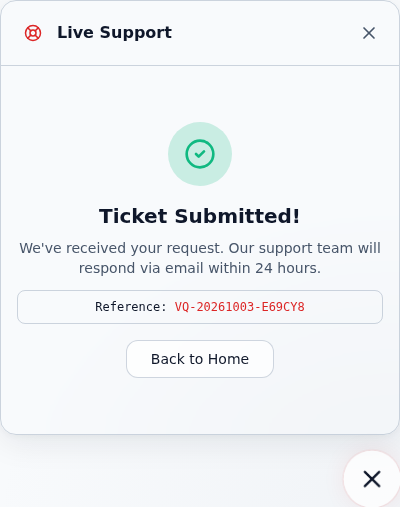
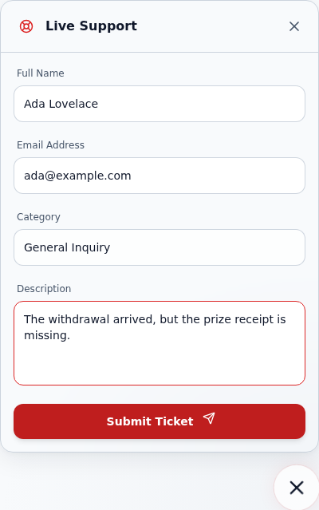

# VaultQuest Testing Guide

This document outlines the testing infrastructure and how to contribute tests.

## Testing Stack

- **Vitest**: Unit and Integration tests for components and hooks.
- **React Testing Library**: UI testing utilities.
- **Playwright**: E2E, Responsive, and Accessibility testing.
- **Axe Core**: Automated accessibility audits.

For a status map of important covered, partial, and missing areas, see
[`docs/TEST_COVERAGE_MAP.md`](./TEST_COVERAGE_MAP.md).

## Running Tests

### Unit & Integration (Vitest)

```bash
npm test
```

To run in watch mode:
```bash
npm run test:watch
```

### Route Smoke Tests (Playwright)

Route smoke tests live in `e2e/route-smoke.spec.ts`. They cover the initial critical public and app routes:

- `/` — marketing landing page
- `/app` — app dashboard in a disconnected-wallet state
- `/app/prizes` — prizes index in a disconnected-wallet state
- `/app/vaults` — vaults index in a disconnected-wallet state
- `/app/admin/settings` — admin settings overview in a disconnected-wallet state

The app-route tests clear browser storage, mock common wallet globals as disconnected, and fulfill `/api/*` requests with empty fixture data so route-level provider, import, and render failures surface consistently. Test names include the route path so CI failures identify the regressed route.

From the repository root, run only the route smoke tests with the existing Playwright CLI:

```bash
pnpm exec playwright test e2e/route-smoke.spec.ts
```

### E2E & Quality Gates (Playwright)

Make sure the dev server is running (or let Playwright start it via `playwright.config.ts`):

```bash
pnpm run test:e2e
```

To see the test results UI:
```bash
pnpm exec playwright test --ui
```

## Mocking Wallet States

We use `wagmi` mocks in `tests/mocks/wagmi.ts`. You can override these in individual tests to simulate different states:

```typescript
import { mockWagmiHooks } from '@/tests/mocks/wagmi';

it('shows error state', () => {
  mockWagmiHooks.useAccount.mockReturnValue({ status: 'error', message: 'Failed to connect' });
  render(<MyComponent />);
  // ...
});
```

## Accessibility (A11y)

E2E tests include automated `axe-core` checks. Ensure all new pages or major UI changes are covered by a Playwright test with `checkA11y`.

## Responsive Design

Playwright is configured to run tests across multiple viewports (Chromium, Webkit, Mobile Chrome, Mobile Safari). Use `isMobile` flag in Playwright tests to handle breakpoint-specific logic.

## Support ticket retries and pending edits

Run the widget and durable-store coverage together with the repository Vitest configuration:

```bash
pnpm exec vitest run components/app/SupportWidget.test.jsx lib/support-tickets.test.js --maxWorkers=1 --minWorkers=1
pnpm check:terms
```

The widget tests control transport timing while using the production
`FileSupportTicketStore`, validation, duplicate lookup, receipt generation, and
JSONL persistence. They cover a lost response after acceptance, unchanged retries
(including edits that are undone), edited retries, edits during a pending request,
stale validation errors, and a wallet change followed by a heuristic duplicate.
The edited retry is also read back through a new store instance.

An unchanged retry reuses its idempotency key. A changed submitted payload gets a
new key. An older response cannot clear the current draft or attach obsolete
validation errors. The intake's duplicate fingerprint does not compare every
field, so any duplicate receipt keeps the draft for review. Receipt notices become
“earlier ticket” notices when the user edits or starts another submission; a
receipt does not imply that newer fields were stored.

### Browser reproduction and evidence

The before/after flow submitted one description, held the HTTP response after
durable acceptance, changed the description, and then released the response.
The original widget switched to success and discarded the edited description.
The repaired widget retained it with an earlier-ticket reference; resubmission
stored both descriptions under distinct keys. The after image is scrolled to the
preserved description and submit button.

| Original widget: edited draft discarded | Repaired widget: edited draft preserved |
| --- | --- |
|  |  |

Two further browser flows returned an unreadable first receipt body after the
ticket had been persisted. An edited retry stored a second ticket with a new key;
an unchanged retry reused its key, returned the existing receipt, and left one
stored ticket. Both flows retained the appropriate draft until its outcome was
known. The browser reported no page exceptions.

Validation on 3 October 2026: **23/23 focused tests passed** using Vitest 2.1.9
and React 18.3.1 with the ordinary repository configuration. `check:terms` passed.
The screenshots came from Chromium rendering the real component and production
CSS against a local HTTP wrapper around the actual intake handler and JSONL
store. That isolated wrapper used Next 16.2.10's `NextResponse`; it was not a run
of the complete Next 14 application.

The full application build, full workspace test suite, full Playwright suite,
hosted CI, and deployed intake were not exercised for this repair. A frozen
workspace installation failed because `backend/package.json` specifies
`@sendgrid/mail@^8.1.0` and `@stellar/stellar-sdk@^12.3.0` without matching lockfile
entries. The root `package.json` has no `test:smoke:routes` script; use the direct
Playwright command above. No dependency manifests or lockfiles were changed here.
